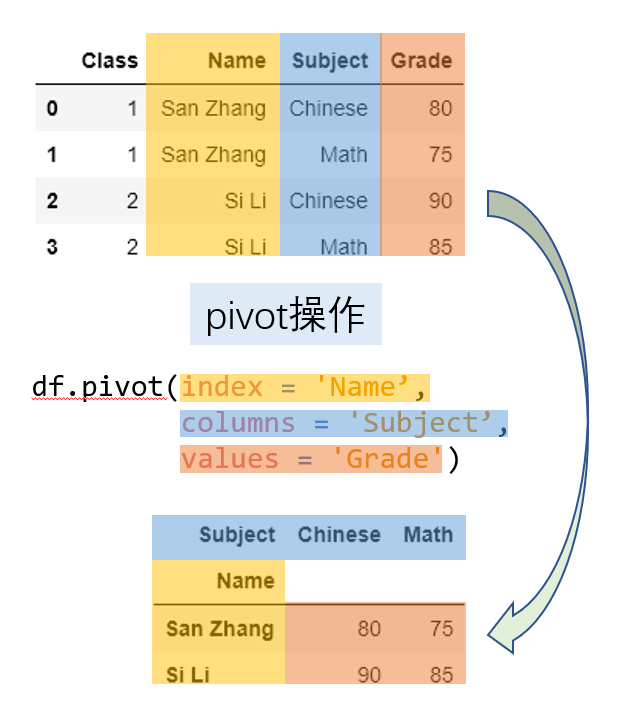
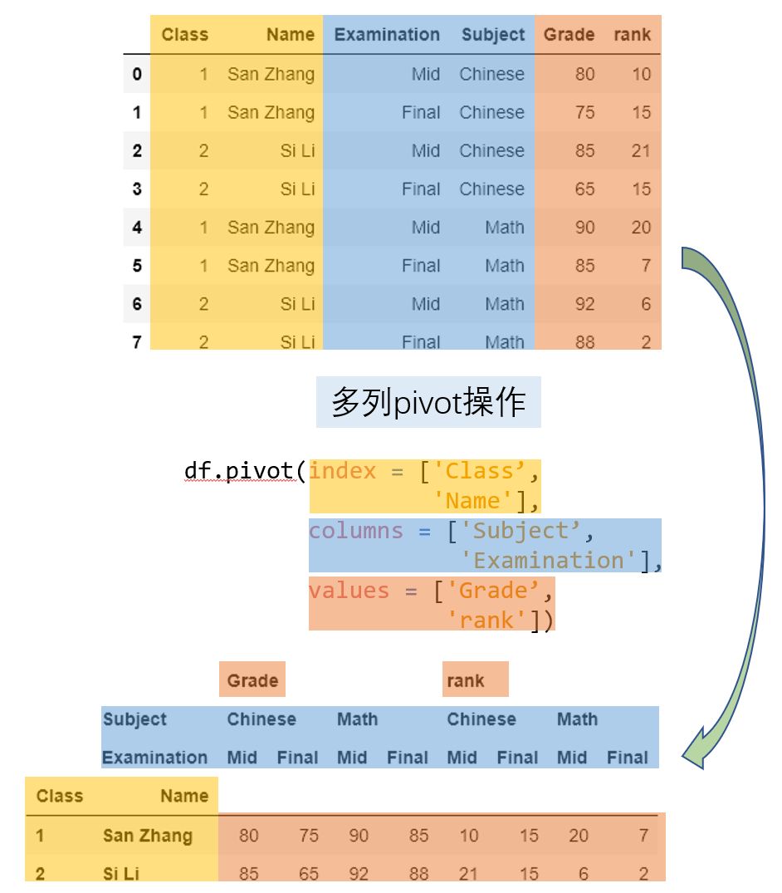
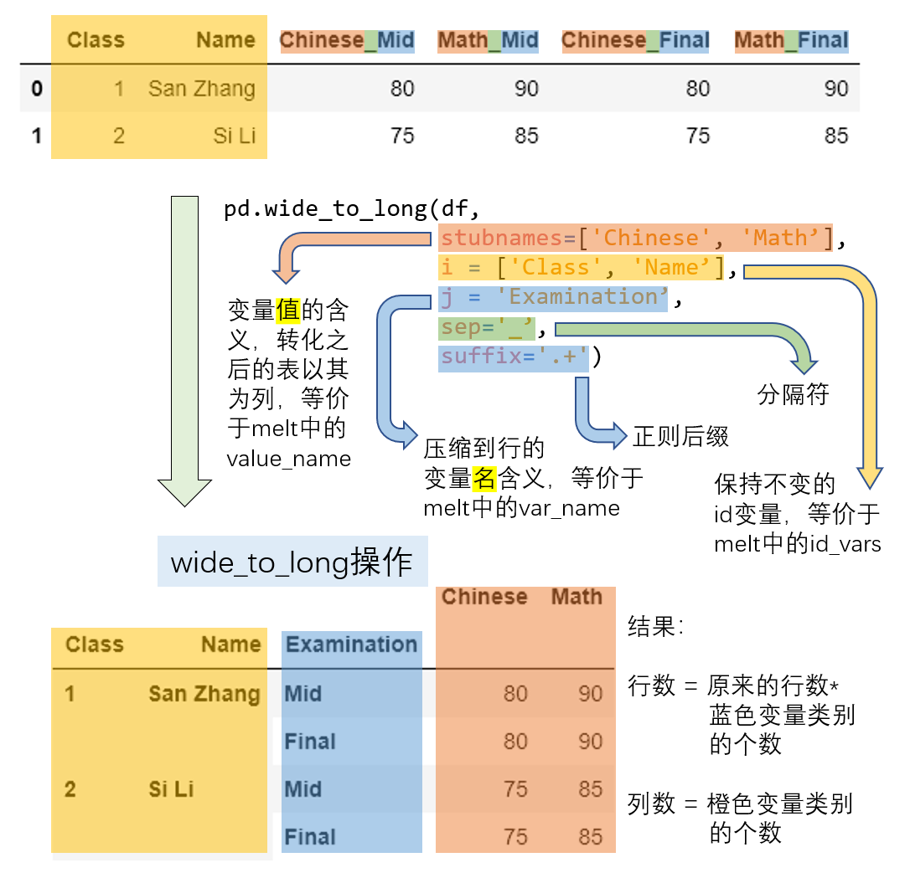

[toc]

# Deform Table
## `pivot`
`pivot` function depends on the uniqueness condition.
```python3
df.pivot(index, columns, values)
```
`index` is a column or list, as the index of new dataframe.\
`columns` is a column or list, as the columns.\
`values` is a column or list, as the values.

Simply,



More, `index`, `columns`, `values` are lists.




## `pivot_table`
`pivot_table` does not depend on the uniqueness.\
It's `aggfunc` parameter appoints a aggregate function.\
```python3
df.pivot_table(index, columns, values, aggfunc, margins)
```
`margins` is a bool value, indicating whether perform marginal aggregation.\
Other parameters are same as `pivot`'s.


## `melt`
Reverse process of `pivot`.
```python3
df.melt(id_vars, value_vars, var_name, value_name)
```
`id_vars`, a column or list, as the index of the new dataframe.\
`melt` makes column names in`value_vars` as a new column named `var_name`.\
And it makes all origin values as a new column named `value_name`.


## `pd.wide_to_long`
```python3
pd.wide_to_long(df,
                stubnames,
                i,
                j,
                sep,
                suffix)
```
`i` as index.\
`stubnames`, `sep`, `suffix`, function uses RegEx to match these three parts.\
It makes `suffix` as the values of a new index named `j`.\
And it makes `stubnames` as columns.




# Deform Index
```python3
df.unstack(levels)
df.stack(levels)
```
`unstack` transforms indexes in `levels` into columns.\
Contrary to `unstack`, `stack` transforms columns into indexes. 


# Other

## `pd.crosstab`
It is similar as to `pivot_table`
```python3
pd.croostab(index, columns, values, aggfunc, dropna)
```
`dropna` is a bool value, default `True`.
Do not include columns whose entries are all NaN.

## `explode`
It could expand elements in a column, which is one of `list, tuple, Series, np.ndarray`.
```python3
df.explode(column)
```

## `get_dummies`
It converts category features into indicator variables.
```python3
pd.get_dummies(df, dummy_na)
```
`dummy_na` is a bool value,
indicating whether regards `NaN` as a dummy.
