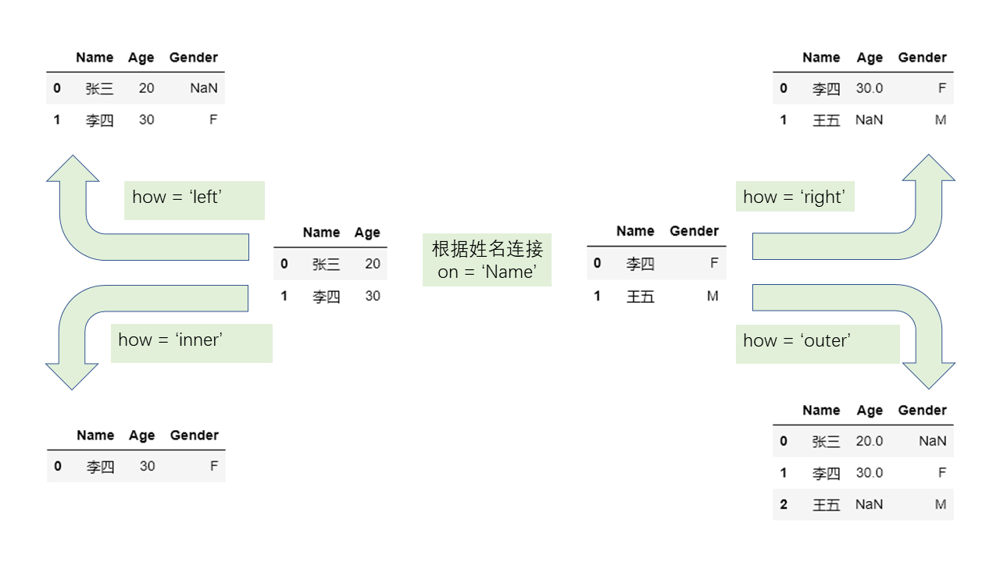

[toc]

# Relational Connection


## `merge`
```python3
df1.merge(df2, on, how)
df.merge(dsf2, left_on, right_on, how)
df1.merge(df2, on, how, suffixes)
```
`on` is a column or a list, the base columns of merging. \
Similarly, `left_on` for left table, `right_on` for right table. \
`how` is a str in ['left', 'right', 'inner', 'outer'], default 'inner' \
`suffixes` is a list with two suffixes,
used to distinguish columns with same name in different tables.

Specially, 
`merge` can check out the correspondence in two tables 
with a parameter `validate`
```python3
df1.merge(df2, on, how, validate)
```
`validate` is a str in ['1:1', '1:m', 'm:1', 'm:m'].


# Index Connection
```python3
df1.join(df2, how, lsuffix, rsuffix)
```

# Directional Connection
## `concat`
```python3
pd.concat(dfs, axis, join, keys)
```
`dfs` is a list of dataframe joined. \
`axis` is the direction, default 0. \
`join` is a str in ['left', 'right', 'inner', 'outer'], default 'outer'. \
`keys` is a list of tips to mark the origin of data.  

## `append` and `assign`
`append` adds a series to table as a new row.\
`assign` adds a series to table as a new column.

```python3
df.append(s, ignore_index)
df.assign(col_name=s)
```
`s` is a series to be added. \
`ignore_index` is a bool value. 
If true, use a automatic index; if false, use `s.name` as index. \
`col_name` is the name of new column.

# Operation similar to connection
## `compare`
```python3
df1.compare(df2)
df1.compare(df2, keep_shape=True)
```
It compares two tables, and outputs a dataframe of difference.\
`keep_shape` means that keep the old shape, default `False`.

## `combine`
```python3
df1.combine(df2, func)
df1.combine(df2, func, overwrite=False)
```
`func`, 
inputs two column with same name in two tables, 
outputs a new column.\
`overtwrite=False` can preserve columns
in the called table 
that do not appear in the passed in parameter table, 
without setting missing values.